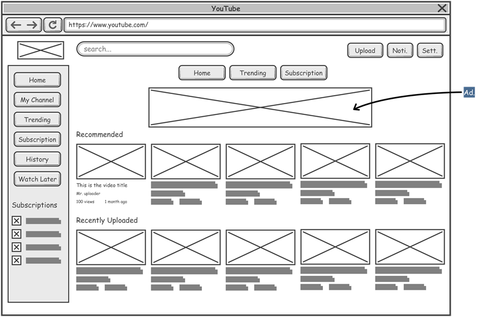

# Projeto de Interface

Pré-requisitos: <a href="2-Especificação do Projeto.md"> Documentação de Especificação</a>

Visão geral da interação do usuário pelas telas do sistema e protótipo interativo das telas com as funcionalidades que fazem parte do sistema (wireframes).

 Apresente as principais interfaces da plataforma. Discuta como ela foi elaborada de forma a atender os requisitos funcionais, não funcionais e histórias de usuário abordados nas <a href="2-Especificação do Projeto.md"> Documentação de Especificação</a>.

## Diagrama de Fluxo

## Wireframes

Os wireframes são protótipos utilizados no design de interfaces para representar a estrutura de um site e o relacionamento entre suas páginas. Eles funcionam como ilustrações do layout e da disposição dos elementos essenciais da interface.

Nesta seção, é FUNDAMENTAL indicar, para cada tela/wireframe proposto, quais requisitos do projeto estão sendo contemplados por aquela tela.

## Tela de Login
### RF-02: A aplicação deve permitir ao usuário realizar login com e-mail e senha.

Wireframes interativos: https://www.figma.com/proto/OYNhGvJ26zoWCy8DU08G29/CONECTABAIRROS?node-id=126-75&p=f&t=u7M68DzBr33xtOhK-1&scaling=min-zoom&content-scaling=fixed&page-id=43%3A2&starting-point-node-id=126%3A75
 
> **Links Úteis**:
> - [Protótipos vs Wireframes](https://www.nngroup.com/videos/prototypes-vs-wireframes-ux-projects/)
> - [Ferramentas de Wireframes](https://rockcontent.com/blog/wireframes/)
> - [MarvelApp](https://marvelapp.com/developers/documentation/tutorials/)
> - [Figma](https://www.figma.com/)
> - [Adobe XD](https://www.adobe.com/br/products/xd.html#scroll)
> - [Axure](https://www.axure.com/edu) (Licença Educacional)
> - [InvisionApp](https://www.invisionapp.com/) (Licença Educacional)
